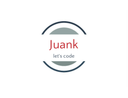

  
   

<!-- TABLE OF CONTENTS -->

# 📗 Table of Contents

- [� Table of Contents](#-table-of-contents)
- [📖 To-Do List ](#-to-do-list-)
  - [🛠 Built With ](#-built-with-)
    - [Tech Stack ](#tech-stack-)
    - [Key Features ](#key-features-)
  - [🚀 Live Demo ](#-live-demo-)
  - [💻 Getting Started ](#-getting-started-)
    - [Prerequisites](#prerequisites)
    - [Setup](#setup)
    - [Install](#install)
    - [Usage](#usage)
  - [👥 Author ](#-author-)
  - [🔭 Future Features ](#-future-features-)
  - [🤝 Contributing ](#-contributing-)
  - [⭐️ Show your support ](#️-show-your-support-)

<!-- PROJECT DESCRIPTION -->

# 📖 To-Do List 

"leader board" is a simple website that displays a list of leaders and allows you to add players and scores to that list. By building this application, I learned how to manage data using JavaScript async code.

## 🛠 Built With 

### Tech Stack 

- HTML
- JavaScript
- CSS
- Webpack

<!-- Features -->

### Key Features 

- **Javascript DOM manipulation**
- **API queries**

(<a href="#readme-top">back to top</a>)

<!-- LIVE DEMO -->

## 🚀 Live Demo 

coming soon...

(<a href="#readme-top">back to top</a>)

<!-- GETTING STARTED -->

## 💻 Getting Started 

### Prerequisites

* Have git installed. (For version control)
* Have text editor installed. (VSCode, sublime, atom)
* Have CSS,HTML & JS Linters installed and configured. For further information, visit [this link](https://github.com/microverseinc/linters-config/blob/master/README.md) to get better understanding on each linters used on this project.

### Setup

Clone this repository to your desired folder:

git clone git@github.com:Juank628/leaderboard.git

### Install

Install this project with:

- npm install    (to install all the packages needed)
- npm run build  (to generate the distribution files)
- npm run dev    (to start the Webpack dev server)

Feel free to change the webpack.config.js file to modify the dev server settings.

### Usage

To register a player:
1. Type the player name and score.
2. Press enter key.
3. The player will be added to the list and will be displayed in it's corresponding position.

<!-- AUTHORS -->

## 👥 Author 

👤 **Juan Carlos Sanchez**

- GitHub: [@Juank628](https://github.com/Juank628)
- Twitter: [@juancadev81](https://twitter.com/juancadev81)
- LinkedIn: [LinkedIn](https://linkedin.com/in/juan-carlos-sanchez-zunino-271b5151)

(<a href="#readme-top">back to top</a>)

<!-- FUTURE FEATURES -->

## 🔭 Future Features 

- [ ] **Database connection**

(<a href="#readme-top">back to top</a>)

<!-- CONTRIBUTING -->

## 🤠Contributing 

Contributions, issues, and feature requests are welcome!

Feel free to check the [issues page](https://github.com/Juank628/leaderboard/issues).

(<a href="#readme-top">back to top</a>)

<!-- SUPPORT -->

## ⭐️ Show your support 

If you like this project, please give us an star

(<a href="#readme-top">back to top</a>)

